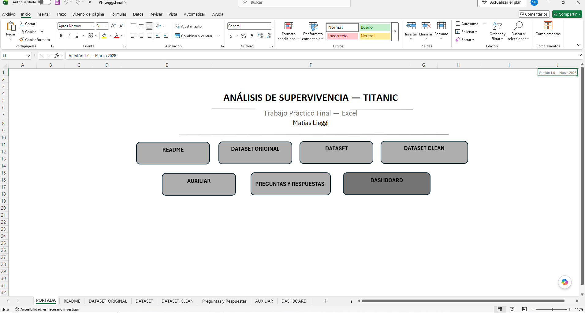
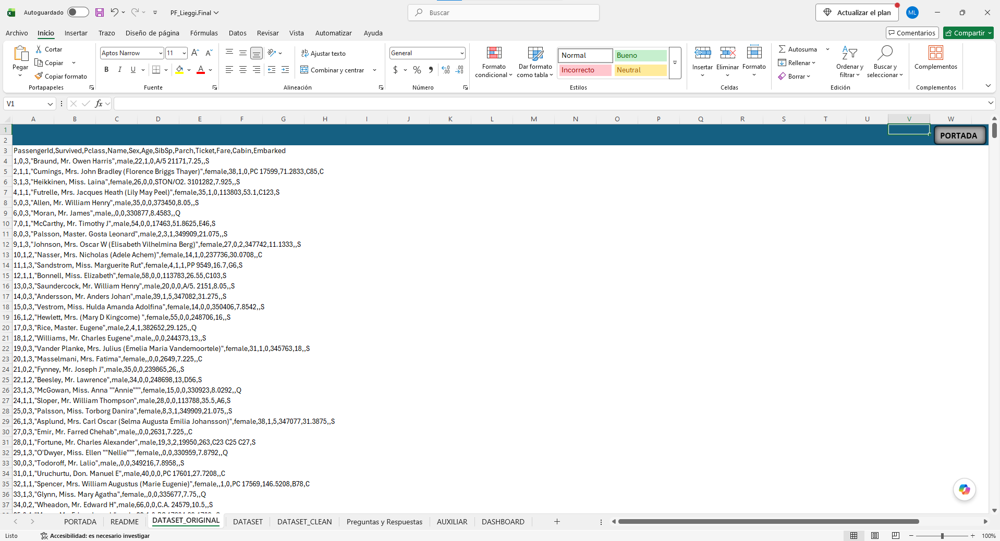
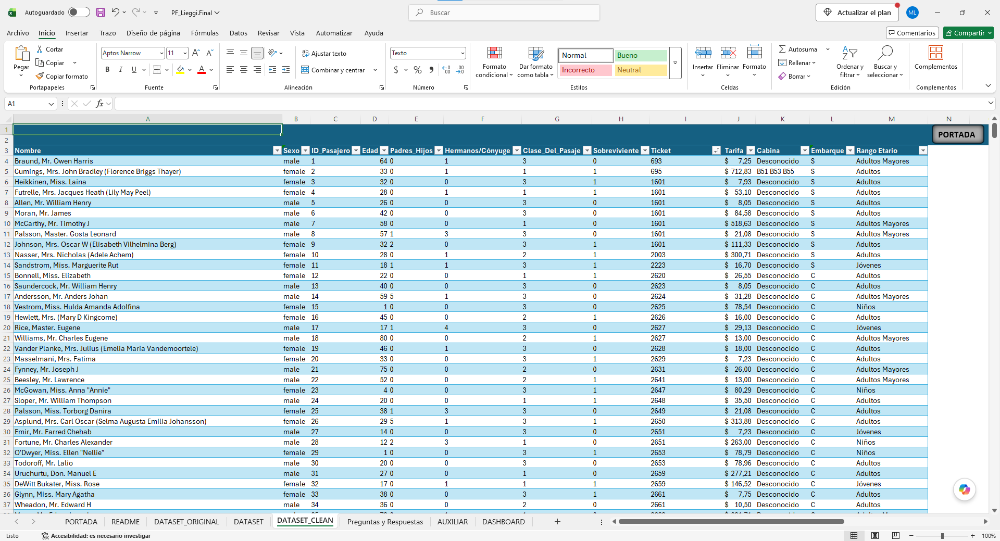
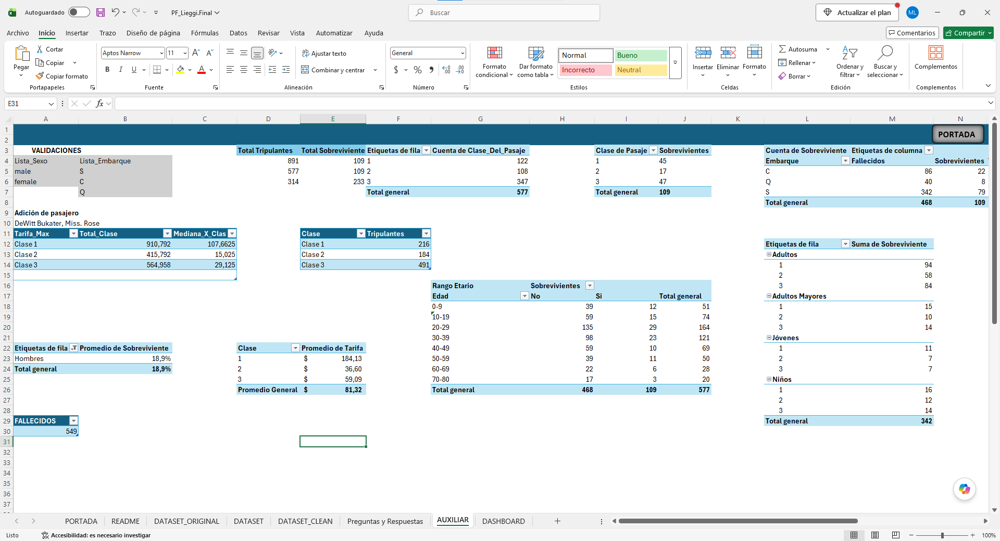
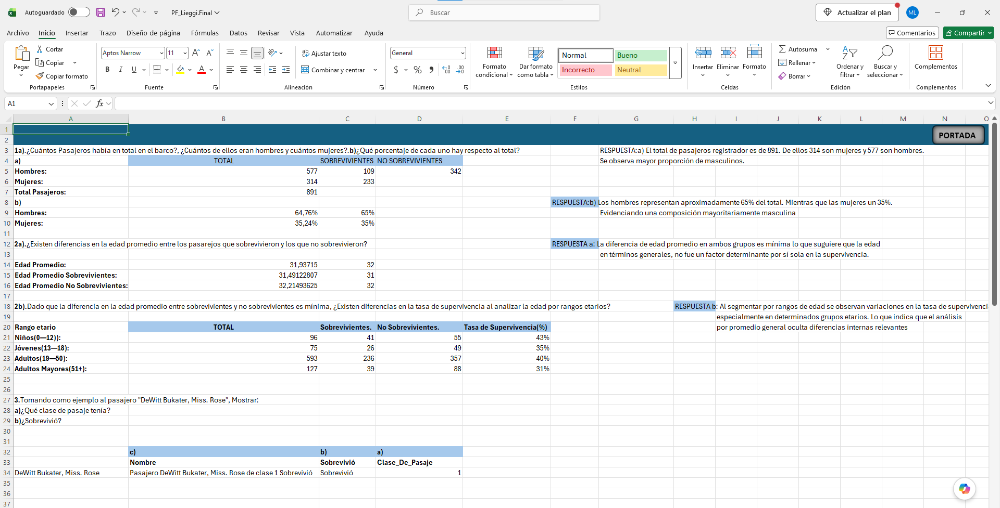
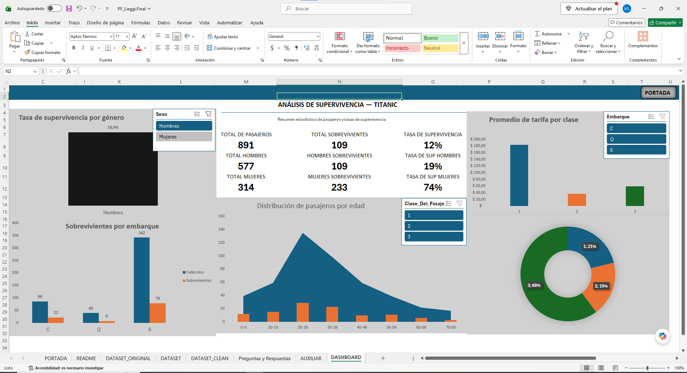

# Excel — Titanic Survival Analysis

## 📊 Project Overview
Interactive Excel dashboard developed to analyze passenger survival on the Titanic, exploring the relationship between gender, age, passenger class and fare with survival outcomes.
The project focuses on transforming raw data into useful business insights through data cleaning, formula-based analysis and interactive visualizations.

## 🎯 Objectives
- Analyze overall passenger survival rate.
- Identify survival differences by gender.
- Explore survival rate by age range and passenger class.
- Analyze average fare paid per class.
- Build an interactive dashboard to support data-driven insights.

## 🛠️ Tools & Technologies
- Excel
- Formulas (VLOOKUP/XLOOKUP, conditional functions)
- PivotTables
- Conditional formatting

## 🔄 Data Preparation
The project included:
- Data cleaning and transformation (Dataset_Original → Dataset_Clean).
- Data type standardization.
- Data organization and preparation.
- Auxiliary sheet with helper tables and calculated functions.
- Q&A analysis sheet to structure the investigation.

## 📈 Key Performance Indicators
- Total Passengers: 891
- Total Survivors: 109 | Survival Rate: 12%
- Male Survival Rate: 19%
- Female Survival Rate: 74%
- Average Fare by Class

## 📊 Dashboard
The workbook includes the following sheets: Portada, README, Dataset_Original, Dataset, Dataset_Clean, Auxiliar, Preguntas y Respuestas, Dashboard.

**Portada**

**Original Dataset (Raw)**

**Clean Dataset**

**Auxiliary Sheet — Helper Tables & Functions**

**Q&A Analysis Sheet**

**Interactive Dashboard**

## 💡 Key Insights
- Female passengers had a significantly higher survival rate (74%) than male passengers (19%).
- The age gap between survivors and non-survivors was minimal, suggesting age alone was not a decisive survival factor.
- Passenger class strongly influenced both fare paid and survival probability.

👤 Author

Matías Lieggi

Junior Data Analyst

SQL | Power BI | Excel | Tableau | DAX | Power Query
